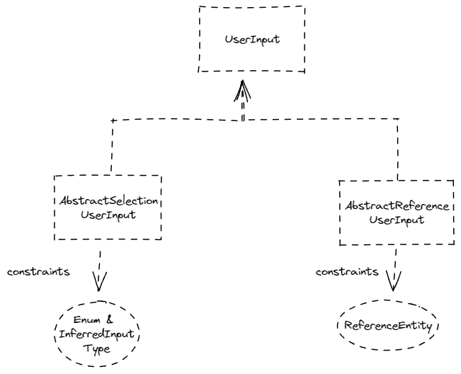

# Dynamic UserInput

This project is created to solve a challenge I had on one of my project to see if there is a way to implement a solution to house various type of userinput namely

- Selection: A static dropdown selection
- FreeText: Freely input text
- Reference: Pointer to other data (via id)

It is also possible to have a mixture of the input type which largely stays within this combination:

- Selection + FreeText
- Reference + FreeText

The object used to demostrate is `Person`

```java
public class Person {
    @Id
    private String id;
    private String name;
    // Selection
    private NationalityUserInput nationality;
    // SelectionFreeText
    private PlaceOfBirthUserInput placeOfBirth;
    // Reference
    private FatherUserInput father;
    // ReferenceFreeText
    private MotherUserInput mother;
}
```



## Background

Given the different ways user can input the data from client side (UI), how can the design of the data structure allows for the various input types as described above?

Think about this, given a field (i.e `PlaceOfBirth`) which could be either selected from the predefined dropdown list, or type as a freetext form if the list does not provide what the user wants

How can this data be provided to the API, and then use it within business logic, and finally stores in the database. What format would it be? And how can we provide type safety when handling the field when writing business logic? Or even validate that the data provided is conformed to the expected values?

> Disclaimer: While this issue could/might be easily resolved by storing a different field `{ "placeOfBirth": "", "others": "something" }`. This attempts is to see if I can simply use the same field to achieve the same outcome

## Goal

Design and implement a way to easily pass the data from `client` to `usage` to `storage`

The consideration are as followed:

- Validation
- Type Safety
- API Payload
- Database Storage

Aside from the above, is it possible to infer the input given by the client and decode to know if it was a `selection` or `freetext` if the client only pass the value to the API

## Payload

This will be the sample payload to be sent to the API endpoint

```json
{
    "name": "hello",
    "nationality": "SINGAPOREAN",
    "placeOfBirth": "SINGAPORE",
    "father": "633421fb64082a7561f90bd0",
    "mother": "non-reference freetext"
}
```

And the document that will be stored in the database

```json
{
    "id": "63393dd4acc4d97a2c71f3bf",
    "name": "hello",
    "nationality": {
        "value": "SINGAPOREAN",
        "inputType": "SELECTION",
        "selectionValue": "SINGAPOREAN"
    },
    "placeOfBirth": {
        "value": "SINGAPO1RE",
        "inputType": "FREETEXT",
        "selectionValue": "OTHERS"
    },
    "father": {
        "value": "633421fb64082a7561f90bd0",
        "inputType": "REFERENCE",
        "collection": "person"
    },
    "mother": {
        "value": "non-reference freetext",
        "inputType": "FREETEXT",
        "collection": ""
    },
}
```

## FreeText

A `FreeText` would just be treated as a `String` without any special handling

## Selection

Given that `nationality` accepts only `SINGAPOREAN and MALAYSIAN`, it can be only inferred as `SELECTION` but also depend on whether it can be mapped to `Nationality` enum class

```json
// given
{
    "name": "hello",
    "nationality": "SINGAPOREAN"
}

// output
{
    "id": "633400ce2f75d7014196f459",
    "name": "hello",
    "nationality": {
        "value": "SINGAPOREAN",
        "inputType": "SELECTION",
        "selectionValue": "SINGAPOREAN"
    }
}
```

```json
// given
{
    "name": "hello",
    "nationality": "SOMETHING"
}

// output
{
    "timestamp": "2022-09-28T08:08:29.476+00:00",
    "status": 400,
    "error": "Bad Request",
    "message": "JSON parse error: Cannot construct instance of `com.bwgjoseph.springmvcdynamicuserinput.NationalityUserInput`, problem: No enum constant com.bwgjoseph.springmvcdynamicuserinput.Nationality.SOMETHING; nested exception is com.fasterxml.jackson.databind.exc.ValueInstantiationException: Cannot construct instance of `com.bwgjoseph.springmvcdynamicuserinput.NationalityUserInput`, problem: No enum constant com.bwgjoseph.springmvcdynamicuserinput.Nationality.SOMETHING\n at [Source: (org.springframework.util.StreamUtils$NonClosingInputStream); line: 3, column: 20] (through reference chain: com.bwgjoseph.springmvcdynamicuserinput.Person[\"nationality\"])",
    "path": "/person"
}
```

## SelectionFreeText

Given that `placeOfBirth` accepts only `SINGAPORE, MALAYSIA and OTHERS`, we can infer the `InputType` to either `SELECTION or FreeText` based on whether it can be mapped to the `Nationality` enum class

```json
// given
{
    "name": "hello",
    "placeOfBirth": "SINGAPORE"
}

// output
// auto inferred as `Selection` type
{
    "id": "633401d12f75d7014196f45a",
    "name": "hello",
    "placeOfBirth": {
        "value": "SINGAPORE",
        "inputType": "SELECTION",
        "selectionValue": "SINGAPORE"
    }
}
```

```json
// given
{
    "name": "hello",
    "placeOfBirth": "SOMETHING ELSE"
}

// output
// auto inferred as `FreeText` type
{
    "id": "633401f72f75d7014196f45b",
    "name": "hello",
    "placeOfBirth": {
        "value": "SOMETHING ELSE",
        "selectionValue": "OTHERS",
        "inputType": "FREETEXT"
    }
}
```

This edge case has yet to be handled, and has to think through how it can / should be handled.

Do we take in `OTHERS` as a valid input? Or it should throw an `BAD_REQUEST`? Because if the chosen input is `OTHERS` then the actual input sent via the API should be some other `freetext` but it is also possible that user input `OTHERS` as the `freetext` as well. As such, how do we handle it? Or this is a constraint as part of the design where we do not support?

```json
// given
{
    "name": "hello",
    "placeOfBirth": "OTHERS"
}

// output
{
    "id": "633402172f75d7014196f45c",
    "name": "hello",
    "placeOfBirth": {
        "value": "OTHERS",
        "inputType": "SELECTION",
        "selectionValue": "OTHERS"
    }
}
```

## Reference

`Selection` and `Reference` have to be treated differently hence the interface will be slightly different as a result. For `Selection` type, we can have the `enum class` to implements `UserInput` such that it will be controlled using `enum` and override when needed. But, for `Reference` type, unless we have a way to let each of the `ReferenceEntity` to implement and return the `InputType` value, it would not be feasible

### First Attempt

Using `@JsonComponent` (See [MotherJsonComponent](src/main/java/com/bwgjoseph/springmvcdynamicuserinput/MotherJsonComponent.java)) is possible over `RequestBodyAdvice` but it is slightly more troublesome to set the value back since we don't work with `objectMapper` to map to `Person` class but instead, dealing with `TreeNode/TextNode`

## Second Attempt

Using `RequestBodyAdvice` allow me to manipulate the object more easily since it has already been serialized to `Person` object

Given an document with `_id: 633421fb64082a7561f90bd0` exist in the database

```json
// given
{
    "name": "hello",
    "nationality": "SINGAPOREAN",
    "placeOfBirth": "SINGAPORE",
    "father": "633421fb64082a7561f90bd0"
}

// output
{
    "id": "63344905508c95326902ff87",
    "name": "hello",
    "father": {
        "value": "633421fb64082a7561f90bd0",
        "inputType": "REFERENCE",
        "collectionName": "person"
    }
}
```

Given that `father` accept only reference value, it has to ensure that if the reference is not found, then it should throw back a `BAD_REQUEST`? Or should it accept and fallback to `FREETEXT` type? At the moment, it is implemented to throw back `BAD_REQUEST`

```json
// given
{
    "name": "hello",
    "nationality": "SINGAPOREAN",
    "placeOfBirth": "SINGAPORE",
    "father": "633421fb64082a7561f90bd0",
}

// output
{
    "id": "6334515b508c95326902ffa0",
    "name": "hello",
    "father": {
        "value": "633421fb64082a7561f90bd0",
        "inputType": "REFERENCE",
        "collectionName": "person"
    }
}
```

```json
// given
{
    "name": "hello",
    "nationality": "SINGAPOREAN",
    "placeOfBirth": "SINGAPORE",
    "father": "633421fb64082a7561f90bd01",
}

// output
{
    "timestamp": "2022-09-28T13:54:07.067+00:00",
    "status": 400,
    "error": "Bad Request",
    "message": "Given father value of 633421fb64082a7561f90bd01 is not valid",
    "path": "/person"
}
```

## ReferenceFreeText

Given that `mother` accepts either reference value, or a freetext, it needs to validate to ensure the given value is not a reference type, and then auto cast it to `FREETEXT`

```json
// given
{
    "name": "hello",
    "nationality": "SINGAPOREAN",
    "placeOfBirth": "SINGAPORE",
    "father": "633421fb64082a7561f90bd0",
    "mother": "non-reference freetext"
}

// output
{
    "id": "63344e08508c95326902ff9b",
    "name": "hello",
    "mother": {
        "value": "non-reference freetext",
        "inputType": "FREETEXT",
        "collectionName": ""
    }
}
```

## Use of DTO

Using [DTO](src/main/java/com/bwgjoseph/springmvcdynamicuserinput/dto/PersonDTO.java) as the request payload to client makes the implementation slightly easier where although the logic to validate stays largely the same but we don't need to use `@JsonComponent` or `RequestBodyAdvice` to achieve the same outcome

In the `PersonDTO`, it simply takes in `String` for the various input no matter which one it is, and then it uses [Spring Converter Class](src/main/java/com/bwgjoseph/springmvcdynamicuserinput/PersonDTOtoPersonConverter.java) to map into the domain object

```java
record PersonDTO(String name, String nationality, String placeOfBirth, String father, String mother) { }
```

```json
// given
{
    "name": "hello",
    "nationality": "SINGAPOREAN",
    "placeOfBirth": "SINGAPORE",
    "father": "633421fb64082a7561f90bd0",
    "mother": "non-reference freetext"
}

// output
{
    "id": "633455a164062158c4895980",
    "name": "hello",
    "nationality": {
        "value": "SINGAPOREAN",
        "inputType": "SELECTION",
        "selectionValue": "SINGAPOREAN"
    },
    "placeOfBirth": {
        "value": "SINGAPORE",
        "inputType": "SELECTION",
        "selectionValue": "SINGAPORE"
    },
    "father": {
        "value": "633421fb64082a7561f90bd0",
        "inputType": "REFERENCE",
        "collectionName": "person"
    },
    "mother": {
        "value": "non-reference freetext",
        "inputType": "FREETEXT",
        "collectionName": ""
    }
}
```

As shown above, the output is exactly the same as the previously method. Note that I have not consider using `PersonResponseDTO` to map the domain object to the response to client


## To be further explore

- Given I have introduce `getValidInputType` which define the valid `InputType` per type, how can this be used for self-validation purpose?

```json
// given
{
    "name": "hello",
    "placeOfBirth": "SINGAPORE"
}

// output
{
    "id": "6333fdad2f75d7014196f450",
    "name": "hello",
    "placeOfBirth": {
        "value": "SINGAPORE",
        "inputType": "FREETEXT",
        "selectionValue": "SINGAPORE",
        "validInputType": false
    }
}
```

`validInputType` will be set to false if in the constructor, the input type is set to something is not allowed. Is this sufficient to catch mistake as this will only be flagged but not prevented. Is it possible to prevent at compile time? Which is to say if I define this `*UserInput` as `Selection`, it should catch early on if I set `InputType` to anything other than `Selection`

At the minimum, it should works as a `checksum`

**Based on current PR proposal, this field will no longer exist, and the responsibility to declare the correct `inputType` lies on the respective implementing class

- Is there any reason to have both `Reference` and `ReferenceFreeText`? Will it always just be `ReferenceFreeText` only? We should provide it nonetheless?
  - There will be use-case where this is valid, hence, both should be supported

- Would it be useful to expose two different API response using `@JsonView` for `service-call` and `consumer-call`?

- What would the worst case scenario when the `enum` does not get updated as it changes (i.e not in sync with the values from source or database)
  - Not in sync with source; source updated but enum not reflected, to clarify, source could be as simple as client and server list
    - This would have to depends on the `InputType` where `Selection` would have issue, but not `SelectionFreeText` as it could be just casted to `OTHERS`
  - Not in sync with database; enum updated but there are old documents referring to old enum value
    - Generally, when the enum value change, migration script would have to be written to handle for that conversion as well

- Technically, I could combine both `Selection` and `SelectionFreeText` into one, what should the one to be removed if decided to? Or is there any reason I can't do so?
  - Further work seem to suggest that `Selection` should just be handled as a `enum` by itself without needed to be a `xxUserInput` since there is no need for any logic, and the wrapper class for `Selection` is pretty much useless

# References

- [java-extending-enums](https://www.baeldung.com/java-extending-enums)
- [java-enum-polymorphism-pattern](https://medium.com/javarevisited/java-enum-polymorphism-pattern-7cbc4e2b92ac)
- [java-enums-you-have-grace-elegance-and-power-and-this-is-what-i-love](http://cyrille.martraire.com/2012/08/java-enums-you-have-grace-elegance-and-power-and-this-is-what-i-love/)
- [get-values-of-generic-enum-that-implements-an-interface](https://stackoverflow.com/questions/64595676/get-values-of-generic-enum-that-implements-an-interface)
- [spring-enum-request-param](https://www.baeldung.com/spring-enum-request-param)

